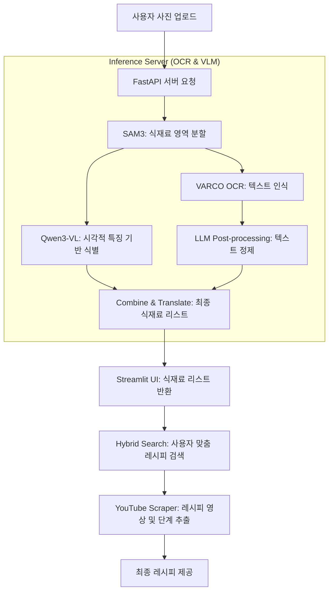

# Save My Dinner (냉장고를 부탁해~~~) 🍽️

**SaveMyDinner**는 사용자가 냉장고 속 식재료 사진을 찍어 올리면, AI가 식재료를 인식하고 이를 바탕으로 최적의 레시피를 추천해주는 스마트 요리 보조 서비스입니다.

**프로젝트 의의**:
최신 멀티모달 AI 모델들의 특성을 분석해 유기적인 파이프라인으로 설계하고, 양자화 및 서버-클라이언트 분리 아키텍처를 통해 실용적인 서비스로 구현해내는 엔지니어링 전 과정을 체계적으로 학습하였습니다.

---

## 🏗️ 시스템 아키텍처

본 프로젝트는 지연 시간을 최소화하고 고성능 AI 추론을 위해 Client (Streamlit)와 Inference Server (FastAPI)로 분리된 아키텍처를 채택하고 있습니다.

### 🎨 전체 파이프라인 (Pipeline)



---

## 🧠 핵심 알고리즘 및 기술 스택

### 1. 식재료 인식 (Vision & OCR)

- **SAM3 (Segment Anything Model v3)**: 이미지 내의 객체들을 정밀하게 분할(Segmentation)하여 개별 식재료의 위치를 파악합니다.
- **VARCO OCR**: 분할된 영역에서 텍스트 정보를 추출하며, 특히 한국어 식재료 명칭 인식에 특화되어 있습니다.
- **Qwen3-VL-8B (VLM)**: 시각 언어 모델을 사용하여 멀티모달 추론을 수행합니다(4-bit quantization 적용)

### 2. 레시피 추천 (Search & VectorDB)

- **ChromaDB & ko-sroberta**: 한국어 특화 임베딩 모델을 사용하여 재료 간의 유사도와 레시피의 적합도를 계산합니다.
- **Hybrid Search**: 벡터 유사도(60%)와 키워드 매칭(40%)을 결합하여, 사용자가 가진 재료가 포함된 가장 관련성 높은 레시피 5개를 제안합니다.
- **Diversity Filter**: 중복되거나 너무 유사한 메뉴를 필터링하여 다양한 요리 후보를 제공합니다.

### 3. 레시피 상세 정보 (YouTube Scraper & LLM)

- **yt-dlp & youtube-transcript-api**: 유튜브에서 해당 요리의 레시피 영상을 찾고 자막 정보를 추출합니다.
- **GPT-4o-mini**: 추출된 자막 데이터를 분석하여 [재료 정보]와 [조리 단계]를 정제된 텍스트 형태로 변환하여 사용자에게 제공합니다.

---

## 🛠️ 기술 스택 (Tech Stack)

| 구분              | 기술                                           |
| :---------------- | :--------------------------------------------- |
| **Frontend**      | Streamlit                                      |
| **Backend**       | FastAPI, Uvicorn                               |
| **Deep Learning** | PyTorch, Transformers, Accelerate, Ultralytics |
| **OCR/VLM**       | VARCO OCR, Qwen3-VL-8B                         |
| **Vector DB**     | ChromaDB                                       |
| **LLM**           | OpenAI GPT-4o-mini                             |

---

## 🚀 실행 방법 (How to Run)

### 0. 가상환경 설정

```bash
python3 -m venv venv
source venv/bin/activate
```

### 1. Inference Server 실행 (Port: 8080)

```bash
cd sever
pip install -r requirements.txt
uvicorn server.server:app --host 0.0.0.0 --port 8080
```

> 서버가 정상적으로 실행되면 `All models loaded successfully!` 메시지가 출력됩니다.

### 2. Streamlit Client 실행 (Port: 8501)

새 터미널 환경에서 가상환경을 활성화한 후 실행합니다.

```bash
cd SaveMyDinner
pip install -r requirements.txt
streamlit run streamlit_app.py
```

---

## 📄 환경 변수 설정 (.env)

`SaveMyDinner/.env` 파일에 다음 항목을 설정해야 합니다:

- `OPENAI_API_KEY`: GPT-4o-mini 및 검색 결과 정제용

---

**TAVE DL 16팀 저메추**
